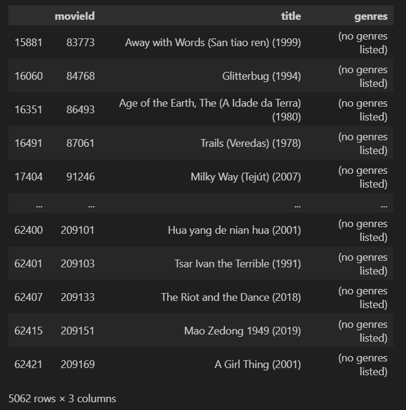
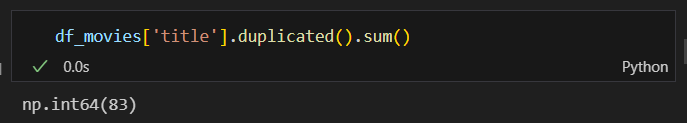
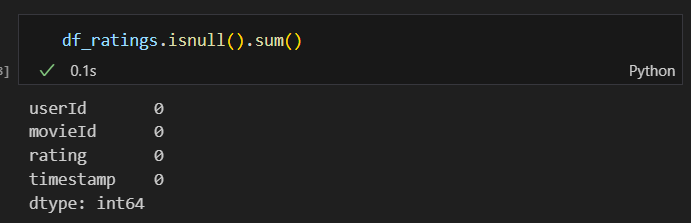
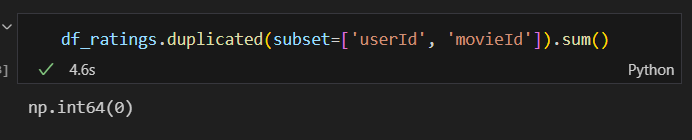
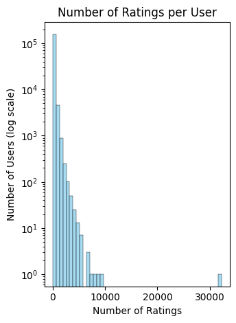

# Laporan Proyek Machine Learning - Muhammad Rizki Al-Fathir

## Project Overview

Seiring dengan ledakan jumlah konten film yang tersedia secara digital, pengguna seringkali dihadapkan pada tantangan information overload, di mana mereka kesulitan menemukan film yang benar-benar sesuai dengan preferensi individual [1]. Fenomena ini dapat menurunkan pengalaman pengguna dan mengurangi efektivitas platform penyedia layanan film dalam menyajikan konten yang relevan. Oleh karena itu, kehadiran sistem rekomendasi menjadi krusial untuk membantu pengguna menavigasi pilihan yang melimpah dan menemukan tontonan yang diminati secara efisien.

Salah satu pendekatan yang efektif untuk mengatasi masalah ini adalah content-based filtering. Metode ini bekerja dengan menganalisis karakteristik atau atribut dari item (dalam hal ini, film), seperti genre, sutradara, aktor, dan deskripsi plot, untuk kemudian merekomendasikan item lain yang memiliki kemiripan fitur dengan apa yang pernah disukai pengguna di masa lalu [2]. Keunggulan utama content-based filtering adalah kemampuannya untuk menyarankan item yang sangat spesifik dan tidak terlalu populer, serta mengatasi masalah cold-start untuk item baru yang belum memiliki interaksi pengguna.

Pengembangan sistem rekomendasi film menggunakan teknik content-based filtering bertujuan untuk menyediakan saran yang lebih personal dan relevan berdasarkan analisis mendalam terhadap konten film itu sendiri. Penelitian telah menunjukkan bahwa analisis fitur genre film dapat meningkatkan akurasi rekomendasi. Dengan demikian, sistem yang diusulkan diharapkan dapat meningkatkan kepuasan pengguna dengan menyajikan pilihan film yang lebih sesuai dengan selera unik mereka, sekaligus membantu pengguna menemukan film-film baru yang mungkin terlewatkan di tengah banyaknya pilihan.

## Business Understanding
Permasalahan utama yang dihadapi pengguna layanan streaming film saat ini adalah kesulitan dalam menemukan film yang sesuai dengan preferensi pribadi akibat banyaknya pilihan yang tersedia, sehingga menyebabkan information overload. Tanpa adanya sistem rekomendasi yang efektif, pengguna cenderung menghabiskan waktu lebih lama untuk mencari film yang diminati atau bahkan melewatkan film-film yang sebenarnya relevan dengan selera mereka. Hal ini tidak hanya menurunkan pengalaman pengguna, tetapi juga berdampak pada efektivitas platform dalam menyajikan konten yang tepat sasaran. Oleh karena itu, diperlukan solusi berupa sistem rekomendasi yang mampu memahami karakteristik film dan preferensi pengguna untuk memberikan saran tontonan yang lebih personal dan relevan.

### Problem Statements

1. **Pengguna kesulitan menemukan film yang sesuai dengan preferensi pribadi akibat banyaknya pilihan yang tersedia.**  
    Banyaknya film yang tersedia di platform streaming menyebabkan pengguna mengalami information overload, sehingga sulit untuk memilih film yang benar-benar sesuai dengan selera atau kebutuhan mereka.

3. **Sulitnya menemukan film-film baru atau kurang populer yang sesuai dengan minat pengguna.**  
    Pengguna cenderung hanya mendapatkan rekomendasi film-film populer, sehingga film-film baru atau niche yang sebenarnya sesuai dengan preferensi mereka sering terlewatkan.

### Goals

Berdasarkan pernyataan masalah yang telah diuraikan, tujuan dari proyek ini adalah sebagai berikut:

- **Membantu pengguna menemukan film yang sesuai dengan preferensi pribadi secara efisien.**  
    Sistem rekomendasi yang dikembangkan bertujuan untuk meminimalkan waktu pencarian dan mengurangi information overload dengan memberikan saran film yang relevan berdasarkan karakteristik film (genre).

- **Meningkatkan kepuasan dan pengalaman pengguna dalam menggunakan platform streaming film.**  
    Dengan solusi yang lebih personal dan relevan, pengguna akan merasa lebih puas dan nyaman dalam menemukan tontonan yang diminati, sehingga meningkatkan loyalitas terhadap platform.

### Solution Statements

Untuk mencapai tujuan yang telah ditetapkan, solusi yang diusulkan dalam proyek ini adalah sebagai berikut:

1. **Mencari Pendekatan Optimal Melalui Perbandingan Dua Algoritma di pendekatan Content-Based Filtering**  
    Sistem rekomendasi akan dikembangkan menggunakan dua algoritma utama di pendekatan Content-Based Filtering, yaitu Nearest Neighbors dengan Euclidean Distance dan Cosine Similarity. Kedua algoritma ini akan dibandingkan performanya dalam menghasilkan rekomendasi film yang relevan. Hasil evaluasi dari kedua metode akan digunakan untuk menentukan pendekatan yang paling optimal dalam konteks data dan kebutuhan pengguna.

2. **Menyajikan Rekomendasi yang Efisien dan Personal**  
    Sistem akan memanfaatkan fitur-fitur konten film, dalam studi kasus ini adalah genre untuk menghasilkan rekomendasi yang sesuai dengan preferensi pengguna. Dengan demikian, pengguna dapat menemukan film yang relevan secara lebih cepat dan efisien, sehingga mengurangi waktu pencarian dan information overload.

## Data Understanding
### Analysis Variable

Dataset yang digunakan dalam studi kasus ini adalah [Movie Recommendation Datasets](https://www.kaggle.com/datasets/parasharmanas/movie-recommendation-system) yang dipublikasikan oleh Manas Parashar di Kaggle. Dataset ini terdiri dari 2 file. 

File pertama yaitu `movies.csv` dengan 62.423 baris data dengan 3 kolom utama, yaitu `movieId` `title`, dan `genres`. 

Berikut adalah penjelasan singkat mengenai masing-masing variabel pada dataset `movies.csv` :
- **movieId**: Merupakan identitas unik untuk setiap film yang tersedia dalam dataset.
- **title**: Judul Film
- **genres**: Menunjukkan satu atau beberapa genre yang dimiliki oleh film, seperti Action, Comedy, Drama, dan lain-lain. 

File kedua yaitu `ratings.csv` yang berisi 25000095 baris data dengan 4 kolom utama, yaitu `userId`, `movieId`, `rating`, dan `timestamp`

Berikut adalah penjelasan singkat mengenai masing-masing variabel pada dataset `rating.csv` :
- **userId**: Merupakan identitas unik untuk setiap user yang melakukan rating
- **movieId**: Merupakan identitas unik untuk setiap film yang tersedia dalam dataset.
- **rating**: nilai rating yang diberikan user
- **timestamp** : Timestamp format Unix , yang merepresentasikan jumlah detik sejak 1 Januari 1970 (UTC).

Satu film bisa memiliki lebih dari 1 genre, format nya menggunakan pipe `|` sebagai pemisah antar genre dalam satu baris

	movieId     	title	                  genres
    1	      Toy Story (1995)	Adventure|Animation|Children|Comedy|Fantasy

Jumlah genre yang terdapat dalam dataset ini sebanyak 20 genre unik, yang mencerminkan keragaman kategori film yang tersedia. Genre-genre tersebut meliputi: 'Adventure', 'Animation', 'Children', 'Comedy', 'Fantasy', 'Romance', 'Drama', 'Action', 'Crime', 'Thriller', 'Horror', 'Mystery', 'Sci-Fi', 'IMAX', 'Documentary', 'War', 'Musical', 'Western', 'Film-Noir', dan '(no genres listed)'.

Keberagaman genre ini memungkinkan sistem rekomendasi untuk memberikan saran film yang lebih bervariasi dan sesuai dengan preferensi pengguna yang beragam. Selain itu, adanya genre '(no genres listed)' menunjukkan bahwa terdapat beberapa film yang tidak memiliki informasi genre, sehingga perlu penanganan khusus pada tahap data preparation agar tidak memengaruhi hasil rekomendasi.

### Dataset Quality
#### Dataset Movies
##### Missing Values

Untuk kondisi awal dataset, terdapat 5062 baris missing value pada kolom genres. Walau ini tidak secara langsung missing value, jika suatu baris memiliki kolom genre dengan nilai `no genres listed` artinya baris tersebut tidak mempunyai data genre, sedangkan data genre sangatlah penting untuk sistem rekomendasi pendekatan Content-Based Filtering

##### Duplicated Values

Untuk kondisi awal dataset, terdapat 82 baris duplikat pada kolom title.

#### Dataset Rating
##### Missing Values

Untuk kondisi awal dataset Rating, tidak terdapat missing value

##### Duplicated Values

Untuk kondisi awal dataset, tidak terdapat baris duplikat

##### Outliers

Pada dataset Rating, terdapat outlier berupa pengguna yang memberikan jumlah rating film yang sangat tinggi dibandingkan pengguna lainnya. Namun karena pendekatan yang digunakan adalah Content-Based filtering, maka outlier ini dapat dihiraukan

### Exploratory Data Analysis
#### Univariate Analysis
##### Datasets Movies

Berdasarkan hasil analisis univariat pada kolom `genres`, dapat dilihat bahwa genre "Drama" merupakan genre yang paling dominan dan paling sering muncul dalam dataset film yang digunakan. Hal ini menunjukkan bahwa film dengan genre drama memiliki proporsi yang lebih besar dibandingkan genre lainnya, sehingga kemungkinan besar preferensi pengguna terhadap genre ini juga cukup tinggi. 

##### Datasets Ratings

Dapat dilihat rating `4.0` memiliki jumlah terbanyak dibandingkan dengan rating yang lain

###### Distribusi User

Rating terbanyak dilakukan oleh userId 72315, dan paling sedikit dilakukan oleh userId 51. Rata rata user melakukan rating sebanyak 153 Rating

#### Multivariate Analysis
##### Datasets Ratings

Plot menggambarkan bahwa rata-rata rating pengguna menjadi lebih stabil dan kurang ekstrem seiring dengan bertambahnya jumlah rating yang mereka berikan. Pengguna dengan sedikit rating bisa memiliki rata-rata yang sangat bervariasi karena sensitivitas terhadap rating individual, sementara pengguna yang sangat aktif cenderung memiliki rata-rata yang lebih moderat dan terkonsentrasi. Ini adalah perilaku yang diharapkan secara statistik: semakin banyak data poin (jumlah rating), estimasi rata-rata akan semakin mendekati "nilai sebenarnya" dan variansnya akan menurun.

## Data Processing
### Memisahkan String Genre menjadi Daftar (List)
Tahapan ini merupakan tahapan pemrosesan field `genres`, yaitu mengubah representasi teks genre yang semula berupa string dengan pemisah pipe (`|`) menjadi sebuah list Python yang dapat diproses lebih lanjut. Misalnya, data `"Adventure|Animation|Children|Comedy|Fantasy"` akan diubah menjadi `['Adventure', 'Animation', 'Children', 'Comedy', 'Fantasy']`.

Tahapan ini diperlukan agar setiap genre pada film dapat diidentifikasi secara individual, sehingga memudahkan proses analisis dan pemodelan. Dengan format list, kita dapat melakukan encoding genre ke dalam bentuk numeril yang sangat penting un

### Menggabungkan dengan dataset Ratings

Kedua dataset digabungkan dengan merge dengan opsi left untuk menjaga nilai dari dataset ratings.

## Data Preparation

### Handle Missing Value
Pada dataset ini, terdapat nilai `(no genres listed)` pada field `genres`. Dalam konteks studi kasus ini, nilai tersebut dianggap sebagai missing value karena sistem rekomendasi berfokus pada informasi genre.

Oleh karena itu, baris data dengan nilai tersebut dihapus agar tidak memengaruhi hasil rekomendasi. Meskipun jumlahnya cukup signifikan, proporsi data yang besar membuat penghapusan ini tidak akan berdampak signifikan terhadap hasil rekomendasi.

Setelah proses merging, terdapat beberapa missing value pada field di dataset Movies. Hal ini terjadi karena ada beberapa film yang memang belum pernah diberi rating oleh pengguna, atau film tersebut sudah terhapus akibat penghapusan genre `no genres listed`.

Nilai null tersebut akan dihapus karena memang sulit untuk diketahui nilainya secara pasti.

### Handle Duplicated Data
Dalam dataset ini terdapat beberapa film yang memiliki entri lebih dari 1 dengan genre dan id yang berbeda.

Pada studi kasus ini, data duplikat akan dihapus dan hanya satu entri yang dipertahankan untuk setiap film. Langkah ini dilakukan guna menyederhanakan proses analisis serta menghindari potensi bias akibat keberadaan genre ganda pada film yang sama.

Setelah merging, terdapat beberapa movieId yang identik karena merging tersebut menggunakan tipe left. nilai duplikat ini dihilangkan karena hanya akan menggunakan data unik untuk dimasukkan ke dalam proses pemodelan

Hasil akhir berbeda dengan df_movies, karena pada dataset ini, baris movies yang tidak ter rating di drop juga. menyisakan data movieId unik yang memang ter rating oleh user. Karena rasio dataset masih besar, maka cara ini masih bisa dilakukan

### Membuat List Genre dan Melakukan Encoding
Tahapan ini merupakan tahapan pemrosesan field `genres`, yaitu mengubah representasi teks genre yang semula berupa string dengan pemisah pipe (`|`) menjadi sebuah list Python yang dapat diproses lebih lanjut. Misalnya, data `"Adventure|Animation|Children|Comedy|Fantasy"` akan diubah menjadi `['Adventure', 'Animation', 'Children', 'Comedy', 'Fantasy']`.

Tahapan ini diperlukan agar setiap genre pada film dapat diidentifikasi secara individual, sehingga memudahkan proses analisis dan pemodelan. Dengan format list, kita dapat melakukan encoding genre ke dalam bentuk numeril yang sangat penting untuk algoritma machine learning yang membutuhkan input numerik.

Tahapan encoding dilakukan dengan pendekatan **MultiLabelBinarizer** dari library scikit-learn. Pendekatan ini sangat efektif untuk mengubah data kategori jamak (multi-label) seperti genre film menjadi representasi numerik yang dapat diproses oleh algoritma machine learning. Dengan MultiLabelBinarizer, setiap genre unik dalam dataset akan direpresentasikan sebagai satu kolom (fitur) biner, di mana nilai `1` menunjukkan film tersebut memiliki genre terkait, dan `0` jika tidak.

Sebagai contoh, jika terdapat tiga genre unik: `Action`, `Comedy`, dan `Drama`, maka film dengan genre `Action|Comedy` akan di-encode menjadi `[1, 1, 0]`. Proses ini memungkinkan setiap film direpresentasikan dalam bentuk vektor fitur biner yang panjangnya sama dengan jumlah genre unik di dataset.

Dengan encoding ini, data genre siap digunakan sebagai input pada model rekomendasi berbasis content-based filtering, seperti Nearest Neighbors atau Cosine Similarity. Proses encoding ini juga memudahkan analisis lebih lanjut, seperti menghitung kemiripan antar film berdasarkan genre.

## Modeling
Pada studi kasus ini, digunakan dua pendekatan yang berbeda, yaitu Nearest Neighbors dengan Euclidean Distance dan Cosine Similarity.

#### Nearest Neighbors
Algoritma Nearest Neighbors bekerja dengan mengukur jarak atau kedekatan antara data baru dengan semua data yang sudah ada dalam dataset. Data baru tersebut kemudian akan diklasifikasikan atau nilainya diprediksi berdasarkan mayoritas kelas atau rata-rata nilai dari sejumlah "tetangga" terdekatnya (sejumlah k data terdekat). Dalam studi kasus ini, menggunakan metric `Euclidean Distance` sebagai metric jarak nya

##### Kelebihan
- Sederhana & Intuitif: Mudah dipahami dandiimplementasikan.
- Efektif Mencari Kemiripan: Bagus untuk menemukan itemserupa atau melakukan rekomendasi.
- Fleksibel: Tidak memerlukan asumsi kuat tentangdistribusi data.
##### Kekurangan
- Kurang efektif untuk data berdimensi tinggi: Pada data dengan banyak fitur (seperti genre film yang banyak),jarak Euclidean bisa menjadi kurang bermakna (curse ofdimensionality).
- Tidak mempertimbangkan arah vektor: Hanya mengukur jarak absolut, sehingga dua film dengan proporsi genre yangsama tetapi skala berbeda bisa dianggap tidak mirip.
- Sensitif terhadap skala fitur: Jika data tidak dinormalisasi, fitur dengan rentang nilai lebih besar akanmendominasi perhitungan jarak.

#### Cosine Similarity on-demand
Cosine Similarity mengukur kesamaan antara dua entitas (tiap genre yang telah di encoding) yang direpresentasikan sebagai vektor. Dalam sistem rekomendasi, ia menghitung kosinus sudut antara vektor-vektor ini; semakin nilainya mendekati 1, semakin mirip kedua entitas tersebut. Sistem kemudian menggunakan kemiripan ini untuk merekomendasikan item yang disukai oleh pengguna serupa, atau item yang serupa dengan yang pernah disukai pengguna.

##### Kelebihan :
- Hemat Memori & Komputasi: Menghindari pembuatan matriks similaritas besar yang boros memori, dihitung hanya saat perlu. Ini penting - untuk   skalabilitas, terutama pada dataset besar.
- Cocok untuk Data Jarang & Dimensi Tinggi: Efektif untuk data seperti teks atau interaksi pengguna-item, di mana banyak nilai adalah nol.

##### Kekurangan : 
- Mengabaikan besaran (magnitude): Hanya memperhatikanarah vektor, sehingga dua film dengan jumlah genre berbedatetapi proporsi sama dianggap identik.
- Kurang sensitif terhadap perbedaan kecil: Pada datayang sangat jarang (sparse), nilai cosine similarity bisatinggi meskipun hanya ada sedikit genre yang sama.
- Perlu komputasi on-demand: Untuk dataset besar,perhitungan kemiripan harus dilakukan secara dinamis agartidak boros memori, yang bisa memperlambat prosesrekomendasi jika tidak dioptimalkan.

#### Hasil Top-N Recommendation
##### Nearest Neighbors  

Hasil Top-N Recommendation dari algoritma Nearest Neighbors diatas menunjukan hasil yang sesuai. Film yang direkomendasikan memiliki genre yang sama dengan film yang menjadi input

##### Cosine Similarity

Hasil Top-N Recommendation dari algoritma Cosine Similarity juga menunjukan hasil yang sesuai, hanya saja terdapat perbedaan urutan film yang direkomendasikannya, tetapi dari keseluruhan film, similarity score nya sama, yaitu 1. Artinya genre hasil rekomendasi dengan film input itu identik.

## Evaluation
### Precision
**Precision** dalam sistem rekomendasi mengukur seberapa relevan item yang direkomendasikan terhadap kebutuhan pengguna. Dalam konteks sistem rekomendasi film berbasis genre seperti pada studi kasus ini, precision dihitung sebagai proporsi film yang direkomendasikan yang benar-benar memiliki genre target (misal: "Comedy") dari seluruh film yang direkomendasikan.

$$\text{Precision} = \frac{\text{Jumlah item relevan yang direkomendasikan}}{\text{Total jumlah item yang direkomendasikan}}$$

Singkatnya, rumus Precision mengukur seberapa banyak dari item yang direkomendasikan oleh sistem memang benar-benar relevan atau disukai oleh pengguna.

* "Jumlah item relevan yang direkomendasikan": Ini adalah item-item yang direkomendasikan sistem dan pengguna memang menganggapnya bagus atau sesuai (dalam studi kasus ini, genre nya identik dengan film inputan).
* "Total jumlah item yang direkomendasikan": Ini adalah semua item yang ditampilkan sistem sebagai rekomendasi.

Jadi, jika sistem merekomendasikan 10 film, dan 7 di antaranya adalah film yang memang  disukai atau anggap relevan karena genre nya identik, maka Precision-nya adalah 7/10 atau 70%. Semakin tinggi nilai Precision, semakin akurat rekomendasi sistem dalam menyajikan item yang benar-benar diinginkan pengguna dari seluruh item yang direkomendasikannya.

Precision penting untuk menilai kualitas rekomendasi karena semakin tinggi precision, semakin banyak rekomendasi yang benar-benar sesuai dengan preferensi pengguna (genre yang dicari)

### Hasil Evaluasi Precision pada Nearest Neighbors

Berdasarkan hasil evaluasi precision di algoritma Nearest Neighbors, diperoleh nilai precision yang sempurna. Hal ini menunjukkan bahwa seluruh film yang direkomendasikan memiliki genre yang sesuai dengan genre pada film input, sehingga rekomendasi yang dihasilkan sangat relevan.

### Hasil Evaluasi Precision pada Cosine Similarity

Berdasarkan hasil evaluasi precision pada algoritma Cosine Similarity, diperoleh nilai precision yang sempurna. Hal ini menunjukkan bahwa data yang digunakan memiliki representasi fitur yang optimal, sehingga kedua algoritma mampu menghasilkan rekomendasi yang sangat relevan dengan nilai precision maksimal.

## Kesimpulan
Berdasarkan hasil evaluasi precision pada sistem rekomendasi film berbasis content-based filtering di atas, diperoleh nilai **Precision@10 = 1.0** untuk kedua metode (Nearest Neighbors dan Cosine Similarity). Artinya, dari 10 film yang direkomendasikan untuk film input (misal: "Pulp Fiction (1994)"), seluruh film yang direkomendasikan memiliki setidaknya satu genre yang sama dengan film input tersebut.

Nilai precision yang tinggi ini menunjukkan bahwa sistem rekomendasi mampu memberikan rekomendasi yang sangat relevan secara genre. Dengan kata lain, setiap film yang direkomendasikan memang sesuai dengan preferensi genre dari film yang dicari, sehingga sistem efektif dalam menyaring film yang benar-benar mirip dari sisi konten (genre).

Namun, perlu diingat bahwa precision hanya mengukur relevansi genre, bukan kualitas keseluruhan rekomendasi (misal: popularitas, rating, atau faktor lain di luar genre). Precision yang tinggi sangat penting untuk memastikan pengguna mendapatkan rekomendasi yang sesuai dengan minat awalnya.

[1] G. Adomavicius and A. Tuzhilin, "Toward the next generation of recommender systems: A survey of the state-of-the-art and possible extensions," IEEE Transactions on Knowledge and Data Engineering, vol. 17, no. 6, pp. 734-749, Jun. 2005, doi: 10.1109/TKDE.2005.99.
[2] P. Lops, M. de Gemmis, and G. Semeraro, "Content-based recommender systems: State of the art and trends," in Recommender Systems Handbook, F. Ricci, L. Rokach, B. Shapira, and P. B. Kantor, Eds. Boston, MA: Springer US, 2011, pp. 73-105, doi: 10.1007/978-0-387-85820-3_3.
